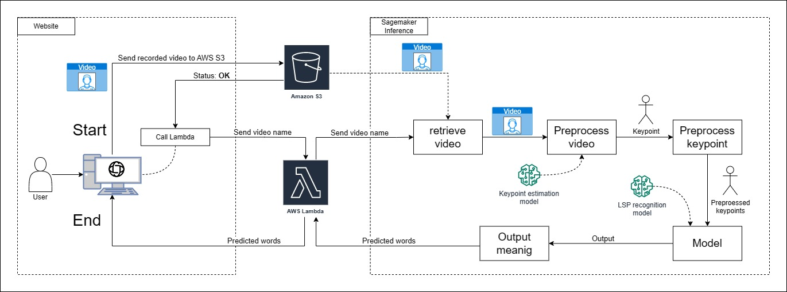

# Deployment
The deployment process involves the following steps:
1. Clone this repository to your local machine.
2. Prepare the model_inference_format folders 
3. Run deploy.py. This script automates the deployment of the Sagemaker endpoint and creates the Docker image required for the EC2 deployment.
4. Use Lambda function to test the deployed model in AWS

In order to use the "Spoter" model from the Sagemaker service, we prepared a Python file called "deploy.py". This model has a simpler implementation, so we do not have dependencies issues.

The "deploy.py" code retrieves AWS credentials from ../configuration/config.json and prepares the Spoter model for deployment in Sagemaker. The code sets the necessary environment variables for authentication and sets the Sagemaker role. A mode.tar.gz file should be uploaded into the S3 Bucket. If you don't have a "model.tar.gz" file, please read the Section 'How to prepare the model_inference_format folder'

Once the model is prepared, the code deploys it to a Sagemaker endpoint using the "PyTorchModel" class. A progress bar will indicate that the inference is being created, and you can check it in the Sagemaker endpoint dashboard. Finally, the code creates a predictor to interact with the deployed model.


## Prerequisites
Before proceeding with the deployment, make sure you have completed the following steps:
1. Created an AWS account with the necessary permissions.
2. Configured AWS credentials on your local machine (Modify the configuration file located in _../configuration/config.json_).
3. Created an S3 bucket for model deployment and video uploads. Make sure the buckets are configured to allow put or get operations, as described in the [AWS S3 Documentation](https://docs.aws.amazon.com/AmazonS3/latest/userguide/creating-buckets-s3.html)
4. Created a Lambda Function to Call Sagemaker as described in [AWS Machine Learning Blog](https://aws.amazon.com/es/blogs/machine-learning/call-an-amazon-sagemaker-model-endpoint-using-amazon-api-gateway-and-aws-lambda/)

## File Structure

```
Inference
├── deploy.py                           [Python script to deploy Inference code]
└── spoter_inference_format
    ├── code
    │   ├── Data                        [subfolder containing data files for inference]
    │   │   ├── Mapeo landmarks librerias - Hoja 1_2.csv
    │   │   └── Mapeo landmarks librerias - Hoja 1.csv
    │   ├── spoter                      [subfolder containing code for SPOTER model]
    │   │   ├── __init__.py
    │   │   ├── experimenter.py         
    │   │   ├── gaussian_noise.py       
    │   │   ├── spoter_model.py         [script defining the SPOTER model architecture]
    │   │   ├── training_spoter.py      [script for training the SPOTER model]
    │   │   └── utils.py                [utility script for SPOTER code]
    │   └── Src                         [subfolder containing source code for inference]
    │       ├── augmentations.py        
    │       ├── czech_slr_dataset.py    
    │       └── Lsp_dataset.py          [script defining the LSP dataset class]
    ├── model.pth                       [file containing pre-trained model for deployment]
    ├── config.json                     [file containing the configuration for the trained model used in inference]
    ├── __init__.py
    ├── inference.py                    [Python script for running inference with the pre-trained model]
    ├── meaning_72.json                 
    ├── meaning.json                    
    ├── points_29.csv                   [file containing landmark coordinates for 29 landmarks used in the model]
    ├── points_71.csv                   [file containing landmark coordinates for 71 landmarks used in the model]
    ├── requirements.txt                [file containing required Python packages for running the inference code]
    └── utils.py                        [utility script for the inference code]


```


## How to prepare the model_inference_format folder
> Note: we change "model" by the name of the model we are using for SLR

Inside that folder you have to place the model and the code you will use for the inference.
This have to be in an specific structure
|- code/
|     - requirement.txt
|     - inference.py
|- model.pth

Where:
* ***requirement.txt*** is the file where are located the dependencies to make the model work
* ***inference.py*** is the file which is referenced in deploy.py where you can find the functions that make the inference work.
* ***model.pth*** is the pre-trained model saved

More information about the structure and the use of sagemaker SDK can be found [here](https://sagemaker.readthedocs.io/en/stable/frameworks/pytorch/using_pytorch.html#bring-your-own-model)

***IMPORTANT***
The file "inference.py" have to have necessary functions:
- def input_fn(request_body, request_content_type):
- def predict_fn(input_data, model):
- def model_fn(model_dir): 
- def output_fn(prediction, content_type):
## Steps to set the inference in production

1. Prepare all the files mentioned before
2. check if the necessary function are set in inference.py
3. got to the "model_inference_format" folder (spoter_inference_format is been used in this example)
4. put in that folder the model.pth prepared in the training of spoter model
5. check if all the parameters in code/config.json are the same as the pre-trained model
6. if it is necessary, the file "code/meaning.json" have to be replaced
7. run 'tar czvf model.tar.gz *' to compress the model and the code folder
8. upload this compress file in the specific AWS S3 bucket for that purpouse 
9. go back to the previous folder
10. In "deploy.py" check if all the parameters are as desired (Note: don't forget to prepare aws configuration)
11. run 'python deploy.py'  

<!-- ## Note

Remember to modify the configuration json file located in "configuration" folder (in root folder)  -->


# General overview of the model we use

<p align="center">
  
</p>

-----------------

# Lessons learned

* Prepare requirement.txt without version to adapt it in the sagemaker endpoint platform
* Sagemaker pip library is all you need to deploy the endpoint (it also possible using the dashboard but is more complicated because you have to configure it manually)
* Always check CloudWatch to know what happend when it deploys.
* Also, when you are coding, left some message using logging library because you can check it on CloudWatch

```
logger = logging.getLogger(__name__)
c_handler = logging.StreamHandler()
c_handler.setLevel(logging.WARNING)
c_format = logging.Formatter('%(name)s - %(levelname)s - %(message)s')
c_handler.setFormatter(c_format)
logger.addHandler(c_handler)
```
* The way the code runs locally is different in sagemaker, you need to add "code" folder in all the imports and in the paths if you use some files such as 'scv', 'json', etc. To solve the first you can add this code at the beginning of the code
```
import sys
sys.path.append('./code')
```
* in "def model_fn(model_dir)" the model_dir variable only have the path to the root where the model is located. So, you need to add the name of the model to this path.

* in the script used for deploy, remember to use in PyTorchModel the following parameters  'framework_version" higher than "1.9.0" to be able to use "py38" in "py_version" 

Note: To train a model you have to use "ConnectingPoints" repository and follow the readme of this respository, or download our preprocessed Hdf5 files from our google drive (this will be added in the future) and modify the dataset path in the config.json of this folder.


## Inference models we tried

During our project, we tested three different inference model deployments:

* Lambda (deprecated)
* Sagemaker with ECR (ECR)
* Sagemaker without ECR (Actual Implementation)

After thorough testing, we found that the Sagemaker NoECR deployment work better.

## Lambda

We worked with two models "m-decoster" and "Smile-lab" model. we do not use this due to the cold start it needs.

## Sagemaker with ECR

We prepared a dockerfile to use the model "Smile-lab" and "Spoter" (state: in process) because this one generates notable better results than "m-decoster". We think that the problem could be in these two places:

 * Not correctly locating the torchserve files and our code in the docker image  
 * Our invocation file is not well implemented and this causes us to get some error messages.
