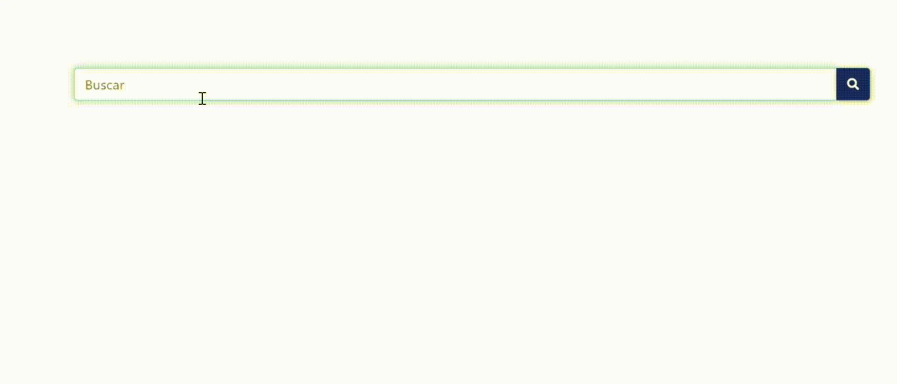
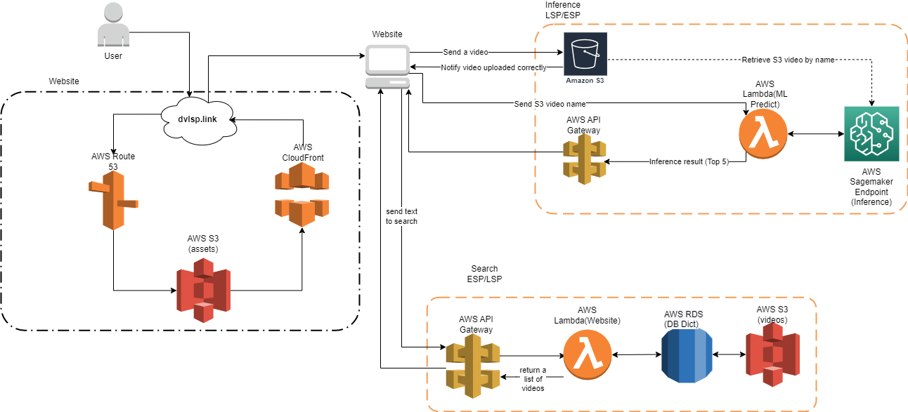

<div align="center">

<p align="center">

</p>
<p align="center">

</p>


<!-- [📚Documentation](https://deeplabcut.github.io/DeepLabCut/README.html) |
[🛠️ Installation](https://deeplabcut.github.io/DeepLabCut/docs/installation.html) | -->
[✌️Dictionary LSP](https://www.dvlsp.link) |
[🗃️Peruvian Sign Language Database](https://drive.google.com/drive/folders/1-DZjxfWbwWhDerW2M5lRFjjR5KC7TWTX?usp=sharing) 


<!-- [](CONTRIBUTING.md)
 -->

</div>

# Welcome!👋
<!-- 
~~The following document details the process required to deploy the Peruvian Sign Language (LSP) Inference System in AWS.~~ -->

Spanish To LSP Translation Service is a virtual platform that provides a comprehensive glossary, including videos, translations into Spanish, sign language transcriptions, and an example sentence for each of the terms. It represents an essential step towards promoting inclusive development for individuals with hearing disabilities. In the following document, we will detail the process required to deploy the Peruvian Sign Language (LSP) Inference System in AWS

## Description

Our architecture has the following modules:

* **Website**: It comprehends the website and services related that permits to show our app in a browser (front-end). <!-- Here is a [Demo] [Services used: Route 53, S3, CloudFormation] --><!-- * **Deployment**: Consists in the services that permits the deployment of the ML model that will allow the inference of our system. [Services used: S3, Sagemaker] -->
* **Inference LSP/Spanish**: Probably the most import module of our architecture which realizes inferences of video streaming from the website and return as a result the sign or a top 5 of similar signs of LSP. [Services used: Sagemaker,  API Gateway] <!-- ~~Kinesis Video Streams(KVS)~~, -->
* **Search Spanish/LSP**: It computes a search of signs from a text input of the website. [Services used: API Gateway, Lambda, RDS/DynamoDB, S3]

The diagram of our architecture is showed bellow:

<p align="center">
  
</p>

<!-- ~~As is written before, we are currently evaluating if the inference of video streams will use Lambda, EC2 or even SageMaker.~~ -->
<!--Links-->
[Demo]: http://lsp-web.s3-website-us-east-1.amazonaws.com/index.html

## How It Works
### **User perspective**
1. Enter to the website
2. For text input, enter your search and then click search. For video input, allow the permissions of your camera and record a 5-10 seconds video for ML inference
3. Receive the result of text/video search
4. Learn LSP!

### **Front-end perspective**
1. Once the Html/CSS/JS files are ready, there is necessary to upload them to S3, then the S3 bucket is configured to public access, Route 53 and Cloud Formation have to be configured with records info of the hosted domain.

### **Back-end perspective**
1. After the training and local test of the ML model there is necessary to create an aws account, configure the AWS credentials, and create a S3 Bucket for the model deployment and video uploads.
2. Make sure the buckets are configured to allow required operations.
3. Deploy the model using Sagemaker as described in [Inference Readme](https://github.com/JoeNatan30/SpanishToPSLTranslationService/tree/main/Inference).<!-- ~~configure an EC2 Linux instance to clone this GitHub Repository and create the Docker Image that have to be uploaded to ECR. (For only EC2 inference is necessary configure a webserver in Django)~~ -->
3. The next step is create a Lambda function to call Sagemaker as a intermediary between the web and the back-end.<!-- 3. The next step is create a Lambda function ~~using the container image~~--> <!-- 4. ~~Simultaneously, is necessary configure KVS signalling channel for video streaming and API Gateway to handle communication between front-end and back-end~~ -->
4. Additionally is necessary configure Lambda functions for text search and the Databases in RDS/DynamoDB.

## File Structure

Upon successfully cloning the repository into your local development environment file structure in your editor:

```
├─ assets  
├─ configuration                    [folder with config.json file with AWS credentials (empty credentials*)]
├─ Inference                        [folder containing deploy scripts and subfolder for deployment]
│  ├─ deploy.py                     [Python script to deploy Inference code]
│  └─ spoter_inference_format       [subfolder for deployment]
│     ├─ code                       [subfolder containing code of the model to be deployed]
│     └─ model.pth                  [file containing pre-trained model for deployment]
├─ website                          [folder containing source code of the front-end implementation]
├─ .gitignore                       [file specifying which files Git should ignore]
├─ .git                             [folder containing Git repository information]
├─ LICENSE                          [file containing software license information]
└─ README.MD  [file containing project description and instructions]

```
## References

<!-- * [~~Amazon Kinesis Video Streams SDK~~](https://github.com/awslabs/amazon-kinesis-video-streams-webrtc-sdk-js) -->
* [Similar use case](https://github.com/brain-power/Brain-Power-Amazon-Fidgetology)

